# Predição da Probabilidade de Adoção de Pets - Pet Adoption Dataset🐶
O Pet Adoption Dataset fornece uma visão compreensiva sobre vários fatores que influenciam a probabilidade de um pet ser adotado de um abrigo. O dataset inclui informações detalhadas sobre animais disponíveis para adoção, cobrindo várias caraterísticas e atributos. Os dados podem ser encontrados no [Kaggle](https://www.kaggle.com/datasets/rabieelkharoua/predict-pet-adoption-status-dataset) e foram disponibilizados por Rabie El Kharoua.

### Features
|Coluna|Descrição|
|-------|--------|
|`PetID`|Identificador único de cada pet|
|`PetType`|Tipo do pet (cachorro, gato, etc.)|
|`Breed`|Raça especifica de cada pet|
|`AgeMonths`|Idade do pet em meses|
|`Color`|Cor do pet|
|`Size`|Tamanho do animal (pequeno, médio, grande)|
|`WeightKg`|Peso em kg|
|`Vaccinated`|Status de vacinação|
|`HealthCondition`|Se o pet é saudável|
|`TimeInShelterDays`|Quanto tempo em dias que o pet está no abrigo|
|`AdoptionFee`|Taxa de adoção|
|`PreviousOwner`|Se o pet teve um dono antes ou não|
|`AdoptionLikelihood`|Probabilidade do pet ser adotado|

## Metas e objetivos
O objetivo deste projeto é (1) fazer uma breve análise exploratória para entender os fatores que levam ao aumento da probabilidade de adoção dos pets, e (2) criar um modelo com foco de prever a probabilidade de adoção dos pets. 

### Resultados
#### Conclusões pós-análise
- Os fatores que maior influência na adoção de pets são aqueles ligados a saúde como vacinação, condições anteriores de saúde, entre outras questões; 
- Animais de médio porte, em especial cães são aqueles com maior probabilidade de adoção, surpreendentemente para mim passáros são bastante buscados em um empate quase técnico com gatos;
- Animais de cor branca tem menor tendência de adoção, provavelmente pela dificuldade manter-los higienizados. Não existe uma grande diferença entre o pet ser recém chegado ou estar a muito tempo no abrigo para a adoção.

#### Modelo de classificação
O modelo escolhido foi o LGBMClassifier da biblioteca LightGBM. Com ele tive os seguintes resultados em métricas:

|Métrica|Resultado|
|---|---|
|**F1 Score**|0.8774|
|**ROC AUC**|0.9019|
|**Accuracy**|0.9228|

## 🛠️ Ferramentas utilizadas

### Bibliotecas Python utilizadas
#### Manipulação de dados
- Pandas, Numpy.
#### EDA
- Seaborn, Matplotlib.
#### Machine Learning
- Scitkit-learn, LightGBM, Category Encoders.

# Análise Exploratória de Dados 
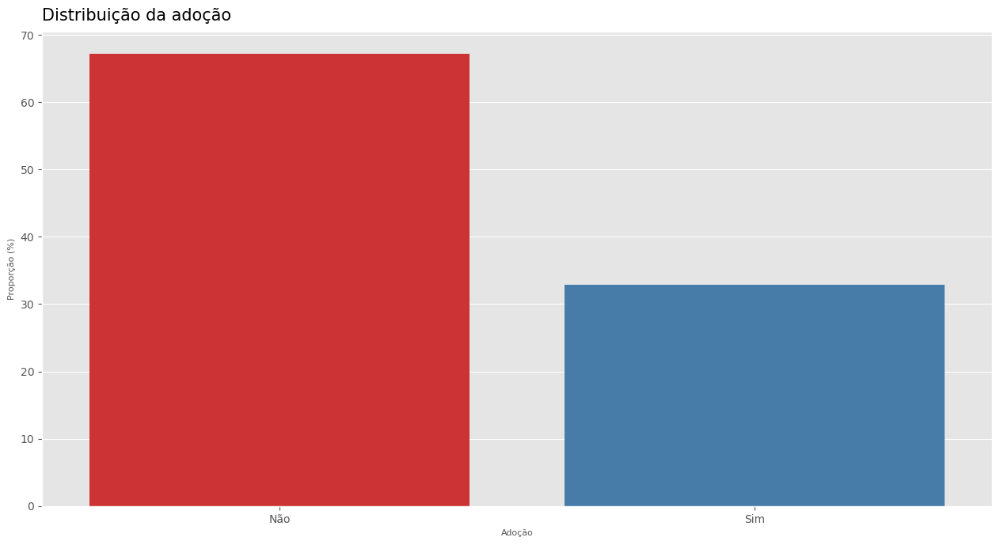

Cerca de 32% dos animais são adotados.

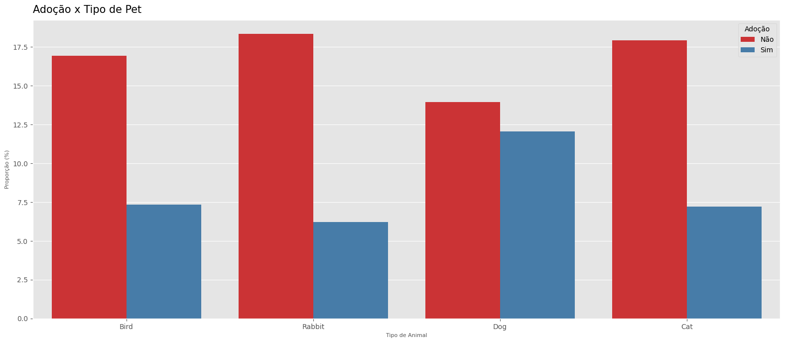

- Cães são o tipo de animal mais frequente dentro do conjunto de dados, coelhos e gatos estão praticamente empatados; 
- Com maior volume de animais em abrigos, cachorros também são os pets mais adotados. Seguidos por passáros e gatos. 

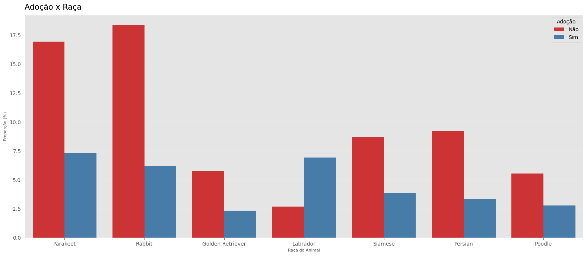

- Não existe distinção entre as raças de coelhos, entre os passáros somente periquitos estão disponíveis; 
- Entre os tipos de animais de estimação que tem raças definidas, os cães da raça Labrador são os mais adotados. Eles são populares por serem amigáveis, inteligentes e sua natureza treinável. 

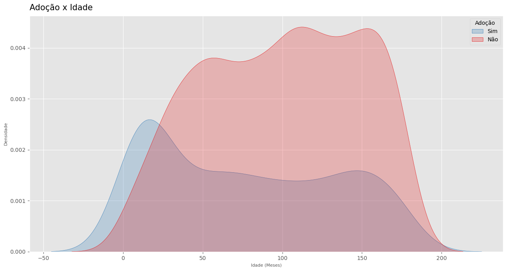

Pets mais velhos tem menor probabilidade de adoção, o fator saúde é o mais importante critério na adoção de animais.

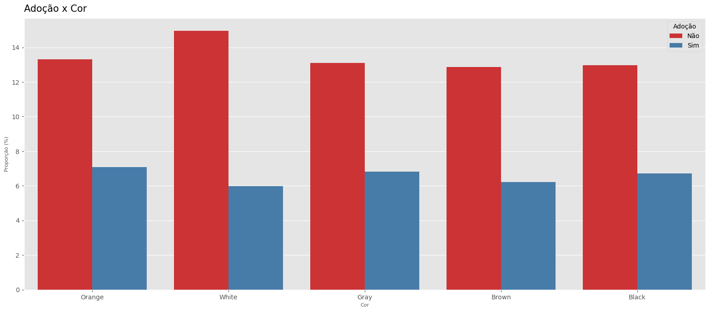

Apesar de estarem em maior quantidade nos abrigos animais de cor branca são os menos adotados, possivelmente por conta da dificuldade manter eles higienizados.

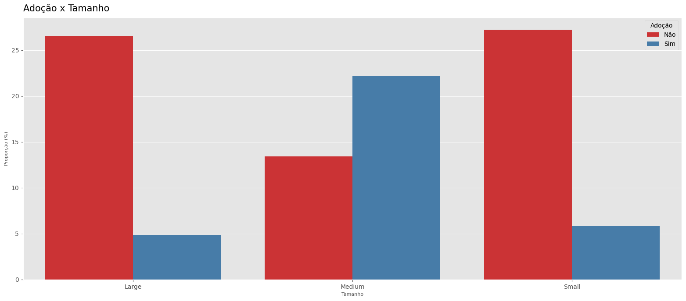

Animais de tamanho médio são a maioria tanto em quantidade nos abrigos, quanto em adoções. Animais de porte maior são os menos adotados. 

- A popularidade de adoção de animais de médio porte tem ligação com sua maior adaptabilidade a diversos ambientes e estilos de vida.
- Animais de grande porte precisam de mais espaço, exercício e treinamento, o que pode levar a menor interesse de adoção.

Vamos olhar de forma mais detalhada por tipo de animal.

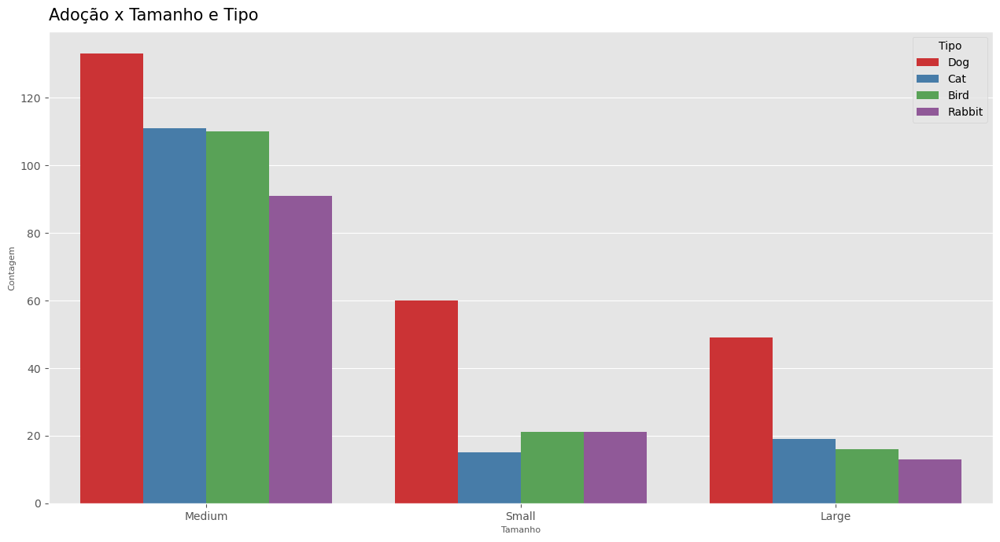

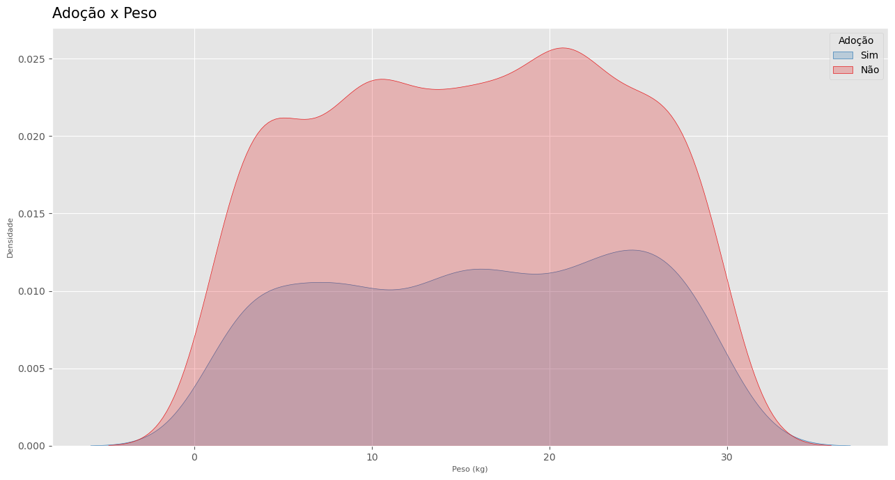

Não é possível somente com a visualização determinar uma forte correlação do peso com a probabilidade de adoção, é uma variável bem dispersa. Vale ressaltar que é importante antes da adoção realizar consultas com um médico veterinário pois a saúde de cada pet depende de vários fatores como raça, idade e sexo. 

Saúde tem sido o fator mais importante observado durante este estudo, vacinação é um dos aspectos mais definidores da saúde de um animal, vacinação é essencial para previnir diversas doenças infecciosas que podem aflingir os bichinhos e serem fatais. 

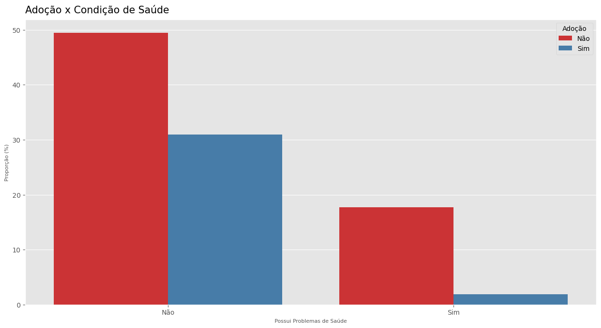

Pessoas que adotam animais com más condições de saúde, tem uma grande paixão pelos bichinhos e estão dispostas a investir tempo, dinheiro e conhecimento para cuidar deles. A baixa taxa de adoção de animais doentes tem ligação com os gastos médicos, problemas comportamentais em potencial e o dano emocional de cuidar de um animal doente. 

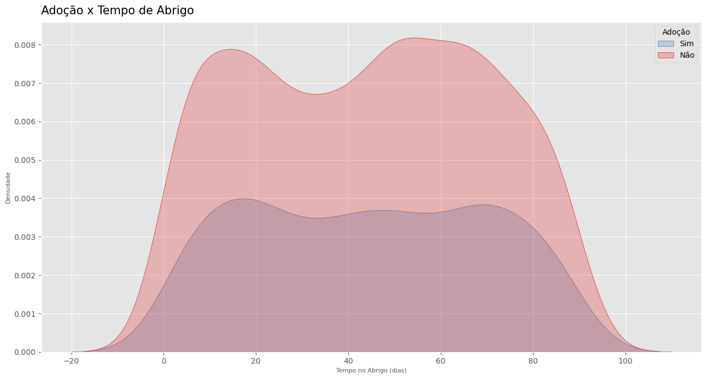

Estar muito tempo no abrigo não faz uma grande diferença na probabilidade de adoção.

Os pets que já tiveram donos anteriormente tendem a ser menos adotados. 

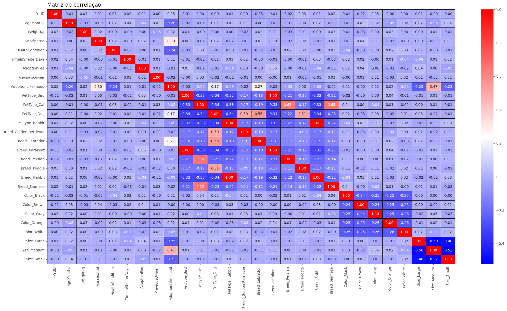

# Modelo de Classificação

Utilizando o LGBMClassifier atingi as seguintes métricas no modelo com threshold padrão de 0.50

|Métrica|Resultado|
|---|---|
|Recall|0.8409090909090909|
|Precision|0.888|
|F1 Score|0.8638132295719845|
|ROC AUC|0.9111111111111112|
|Accuracy|0.9129353233830846|

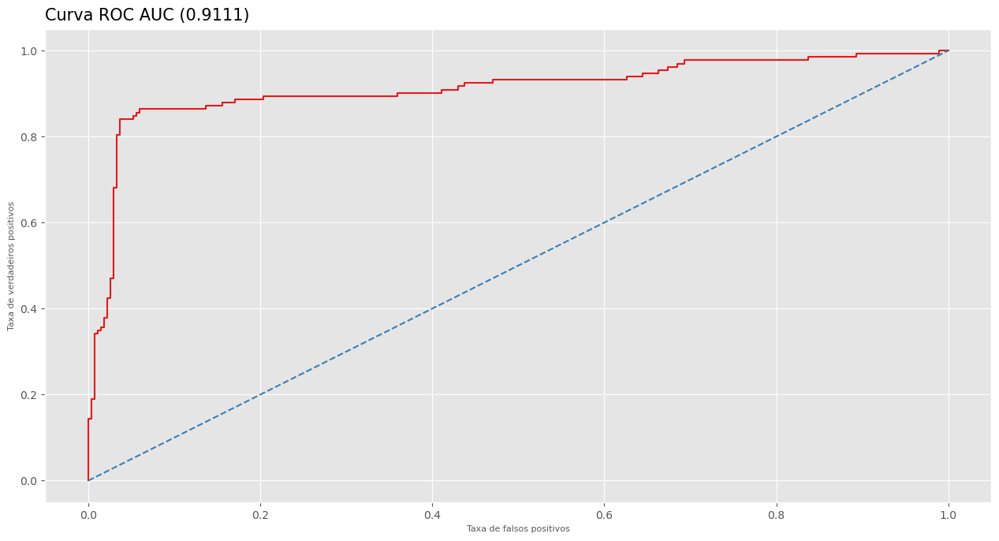

O modelo tem bons resultados de acurácia e ROC AUC, além de boa sensibilidade e precisão que podem ser otimizados através de ajustes no limiar. Vamos explorar opções para ter o melhor F1 Score, que a métrica de equilibrio entre precisão e sensibilidade.

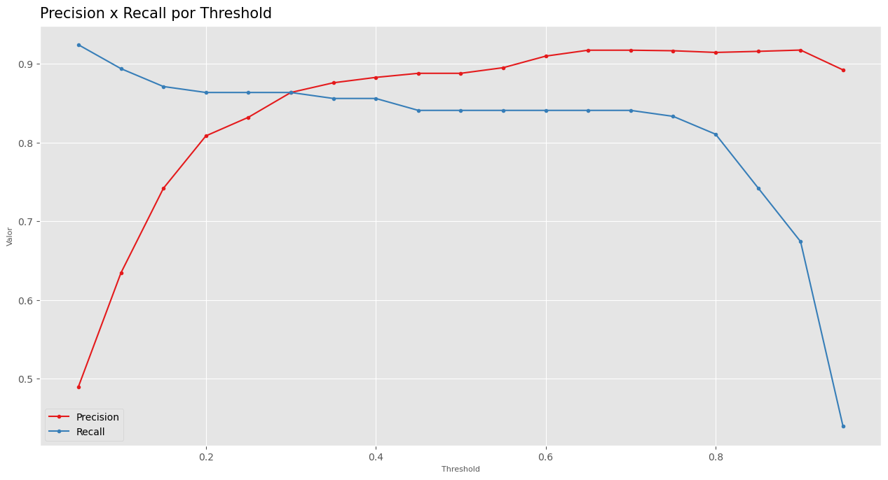

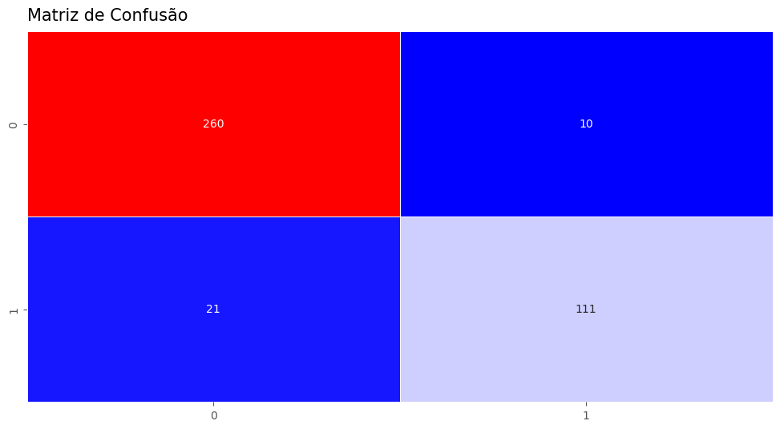

|Métrica|Resultado|
|---|---|
|Recall|0.8409090909090909|
|Precision|0.9173553719008265|
|F1 Score|0.8774703557312253|
|ROC AUC|0.9019360269360269|
|Accuracy|0.9228855721393034|

Com o limiar ajustado para 0.65 temos uma melhora na precisão para as duas classes e apenas uma perca pequena na sensibilidade da classe 0. E assim temos o modelo com o limiar ideal. 

